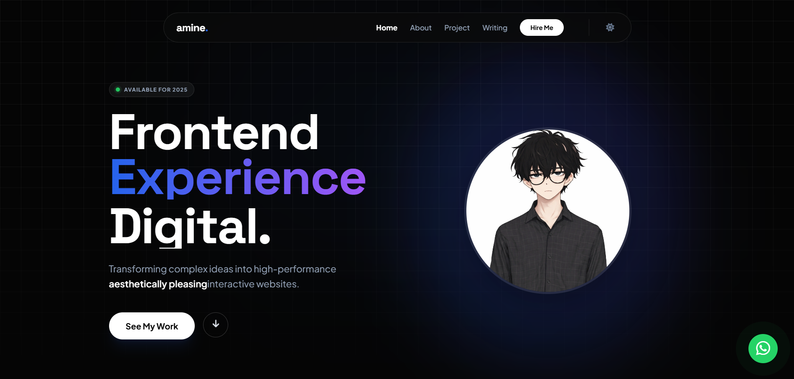

# Amine – Creative Developer Portfolio 🚀

A modern, high-performance personal portfolio website showcasing my work as a **Frontend Developer & UI/UX Designer**.  
Built with a strong focus on **animations, performance, and user experience**.

---

## Live Demo 🚀

You can view the live website here: [Live Demo](https://silver-pothos-bdbfe5.netlify.app/)

---

## ✨ Features

- 🌙 **Dark / Light Mode** (saved in LocalStorage)
- ⚡ **Preloader Animation**
- 🎯 **ScrollSpy Navigation**
- 🧲 **Magnetic Button Effect**
- 💡 **Spotlight Hover Cards**
- 🌀 **3D Tilt Project Cards**
- 🖼️ **Parallax Images**
- 📂 **Project Filtering System**
- 🪟 **Project Modal Preview**
- 🔔 **Toast Notifications**
- 👁️ **Intersection Observer Scroll Reveal**
- 📱 Fully **Responsive Design**

---

## 🛠️ Tech Stack

- **HTML5**
- **CSS3** (Custom + Advanced Animations)
- **Tailwind CSS (CDN)**
- **JavaScript (Vanilla)**
- **Font Awesome**
- **Google Fonts**

---

## 📂 Project Structure

```bash
📦 Portfolio9
 ┣ 📜 index.html          # Main HTML file
 ┣ 📜 style.css           # Website styling
 ┣ 📜 script.js           # Main JavaScript file
 ┣ 📂 images              # Images and logos
 ┗ 📜 README.md           # Project documentation
```
---


## 🚀 How to Use / Customize

1. **Clone the repository:**

 ---

## 📬 Contact

- Email: aminehamzaoui1925@gmail.com   
- Location: Boumerdès, Algeria  
- LinkedIn: [LinkedIn](https://www.linkedin.com/in/mohamed-amine-hamzaoui-a2453a35b/)  
- GitHub: [GitHub](https://github.com/Saboo24)  
- Instagram: [Instagram](https://www.instagram.com/a__m.i.n__e/?utm_source=ig_web_button_share_sheet)

---

Made with ❤️ by **Amine Hamzaoui**

```bash
git clone https://github.com/Saboo24/Portfolio9.git

